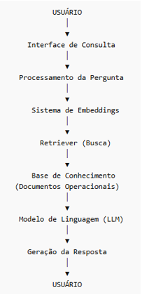

# Hiperautomação com RAG para Gestão Operacional de Condomínio Logístico

Este repositório apresenta um projeto acadêmico de hiperautomação cognitiva aplicado à gestão operacional de um condomínio logístico, utilizando Inteligência Artificial e Retrieval Augmented Generation (RAG).
O trabalho aborda a integração entre tecnologias de IA, processamento de linguagem natural e organização de bases documentais, com o objetivo de automatizar a consulta e interpretação de informações operacionais em um ambiente corporativo.

---

## 🧠 Visão Geral
Este projeto propõe a aplicação de hiperautomação cognitiva com RAG para apoiar a consulta de documentos operacionais, regulatórios e técnicos de um condomínio logístico.

---

## 📌 Problema
A gestão documental em condomínios logísticos depende de múltiplos documentos técnicos, cuja consulta manual é demorada e sujeita a falhas. 

---

## 🎯 Objetivo
Desenvolver um assistente inteligente capaz de consultar documentos operacionais e regulatórios e fornecer respostas em linguagem natural para apoiar a gestão do condomínio.

---

## ⚙️ Tecnologias Envolvidas
- Inteligência Artificial
- LLM
- RAG
- NLP
- Engenharia de Prompt
- Busca semântica

---

## 🚀 Diferenciais

- Uso de RAG (Retrieval Augmented Generation)
- Aplicação real em ambiente operacional
- Integração de IA com base documental
- Engenharia de prompt aplicada
- Foco em governança e confiabilidade

---

## 📊 Resultados Esperados
- Redução do tempo de busca por informações
- Apoio à tomada de decisão
- Melhoria da conformidade regulatória
- Preservação do conhecimento institucional

---

## Estrutura do Projeto
- `docs/`: documentação do projeto
- `README.md`: visão geral do trabalho
- 

---

## 📌 Aplicações

- Consulta de procedimentos operacionais
- Apoio a auditorias
- Verificação de licenças e validade
- Suporte à tomada de decisão

---

## ⚠️ Limitações

- Dependência da qualidade dos documentos
- Necessidade de atualização da base
- Possíveis respostas incompletas

---

## 🎓 Contexto Acadêmico

Este projeto foi desenvolvido no contexto acadêmico do curso de Análise e Desenvolvimento de Sistemas, com foco na aplicação prática dos conceitos de hiperautomação, inteligência artificial e recuperação de informações por meio da arquitetura Retrieval Augmented Generation (RAG).

🏫 Instituição: Faculdade Nova Roma

📚 Disciplina: Projeto Integrador V

👨‍🏫 Professor: Álvaro Pinheiro

## 👩‍💻 Autoria

Cristiane Hayashi V Lima
